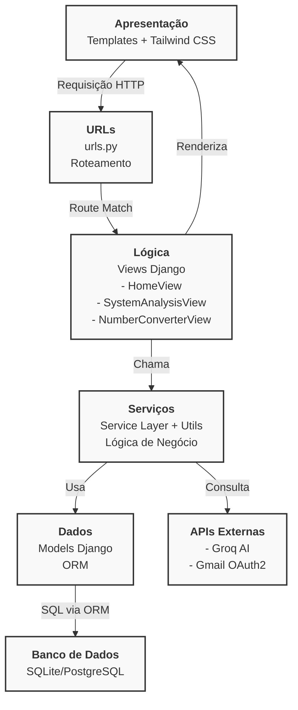

# Arquitetura do Morpheus Env

Design técnico, padrões de arquitetura e decisões de design do Morpheus Env.

---

## Arquitetura em camadas


---

## Padrão da Camada de Serviços (Service Layer)

Toda lógica de negócio está em `services/` ou `utils/`, nunca nas views.

**Estrutura**:

```
tools/services/
├── system_metrics.py      # Coleta de métricas
├── ai_analysis.py         # Integração Groq
└── num_converter.py       # Conversões numéricas

notifications/utils/
├── send_email.py          # Envio de emails
├── email_oauth2.py        # OAuth2 Google
├── colors.py              # Mensagens coloridas
└── emails.py              # Templates de email
```

**Benefícios**:

- Testabilidade: Testar service sem view
- Reutilização: Usar service em CLI, testes, APIs
- Responsabilidade única: Separação clara

**Exemplo**:

```python
# tools/services/system_metrics.py
def get_system_status():
    """Coleta métricas do sistema."""
    return {
        'cpu_percent': psutil.cpu_percent(),
        'ram_percent': psutil.virtual_memory().percent,
    }

# tools/views.py
class SystemAnalysisView(LoginRequiredMixin, generic.View):
    def get(self, request):
        data = get_system_status()  # Simples e clara
        return JsonResponse({'data': data})

# tools/tests.py
def test_get_system_status():
    data = get_system_status()
    assert 'cpu_percent' in data
```

---

## Fluxos de Dados

### Monitoramento de Sistema

```
Browser (JavaScript)
    ↓ (5 segundos)
GET /sistema/monitoramento/v1/metrics-api
    ↓
SystemAnalysisAPIView.get()
    ↓
get_system_status() → psutil
    ↓
JsonResponse
    ↓
Frontend atualiza DOM (CPU, RAM, Disco)
```

### Análise por IA

```
Usuário clica "Gerar análise"
    ↓
GET /sistema/monitoramento/v1/ai-api
    ↓
AiAPIView.get()
    ↓
get_ai_analysis()
    ├─ get_system_status() (coleta dados)
    ├─ sanitize_system_data() (normaliza)
    └─ groq.chat.completions.create()
    ↓
Groq API (análise textual)
    ↓
JsonResponse
    ↓
Frontend exibe resultado
```

### Conversão Numérica

```
Usuário insere valor
    ↓
onclick="converter()" (JavaScript)
    ↓
GET /sistema/conversor/v1/api?type=dec2bin&value=255
    ↓
NumberConverterAPIView.get()
    ↓
Mapeia type → função
    ↓
dec_to_bin(255)
    ↓
JsonResponse({'result': '11111111'})
    ↓
Frontend exibe resultado
```

### Registro de Usuário

```
POST /accounts/registrar/
    ↓
CustomUserCreationForm.is_valid()
    ├─ clean_username()
    ├─ clean_email() (verifica blocklist)
    └─ clean_password*()
    ↓
User.objects.create_user()
    ↓
Signal post_save dispara
    ↓
send_new_user_email()
    ├─ (se EMAIL_MODE=True)
    └─ OAuth2 Google + SMTP
    ↓
Email enviado
```

---

## Decisões Arquiteturais

### Django vs Framework Minimalista

**Escolha**: Django

**Razão**: Baterias incluídas (autenticação, ORM, admin, migrations) essenciais para projeto acadêmico.

---

### Camada de Serviço

**Escolha**: Lógica separada em `services/`

**Razão**: 

- Código testável
- Reutilizável em múltiplos contextos
- Fácil de manter

---

### Rate Limiting por Usuário

**Escolha**: `django-ratelimit` com chave `user`

**Razão**:

- Previne abuso de APIs caras
- Justo: limita por uso, não por IP
- Fácil de implementar

---

### Validação de Email com Blocklist

**Escolha**: Arquivo estático `disposable_email_blocklist.conf`

**Razão**:

- Sem dependência externa
- Rápido e eficiente
- Customizável

---

## Segurança em Camadas

```
1. HTTPS (produção)
   └─ SSL/TLS encryption

2. Middleware Django
   ├─ CSRF protection
   ├─ XSS prevention (autoescape)
   └─ Clickjacking (X-Frame-Options)

3. Autenticação
   ├─ Senhas PBKDF2 (260k iterações)
   ├─ Sessão HttpOnly
   └─ OAuth2 para APIs

4. Validação de Input
   ├─ Form validation
   ├─ Email blocklist
   └─ Rate limiting

5. Banco de Dados
   ├─ ORM Django (SQL injection prevention)
   └─ Parameterized queries
```

---

## Performance

### N+1 Query Problem

**Evitar**:

```python
users = User.objects.all()
for user in users:
    print(user.profile.bio)  # Query extra para cada usuário
```

**Usar**:

```python
users = User.objects.select_related('profile')
```

### Cache (Futuro)

Para produção:

```python
@cache_page(60 * 5)  # Cache por 5 minutos
def get_metrics(request):
    return JsonResponse(get_system_status())
```

---

## Escalabilidade

### Produção Multi-Server

```
Load Balancer (Nginx)
    ↓
├── Server 1 (Gunicorn)
├── Server 2 (Gunicorn)
└── Server 3 (Gunicorn)
    ↓
PostgreSQL (compartilhado)
    ↓
Redis (cache compartilhado)
```

### Async Views (Futuro)

Django 3.1+ suporta async:

```python
async def async_analysis(request):
    data = await get_ai_analysis_async()
    return JsonResponse(data)
```

---

## Próximas Etapas

- [Segurança](./security.md) - Detalhes de proteção
- [Desenvolvimento](./development.md) - Workflow local
